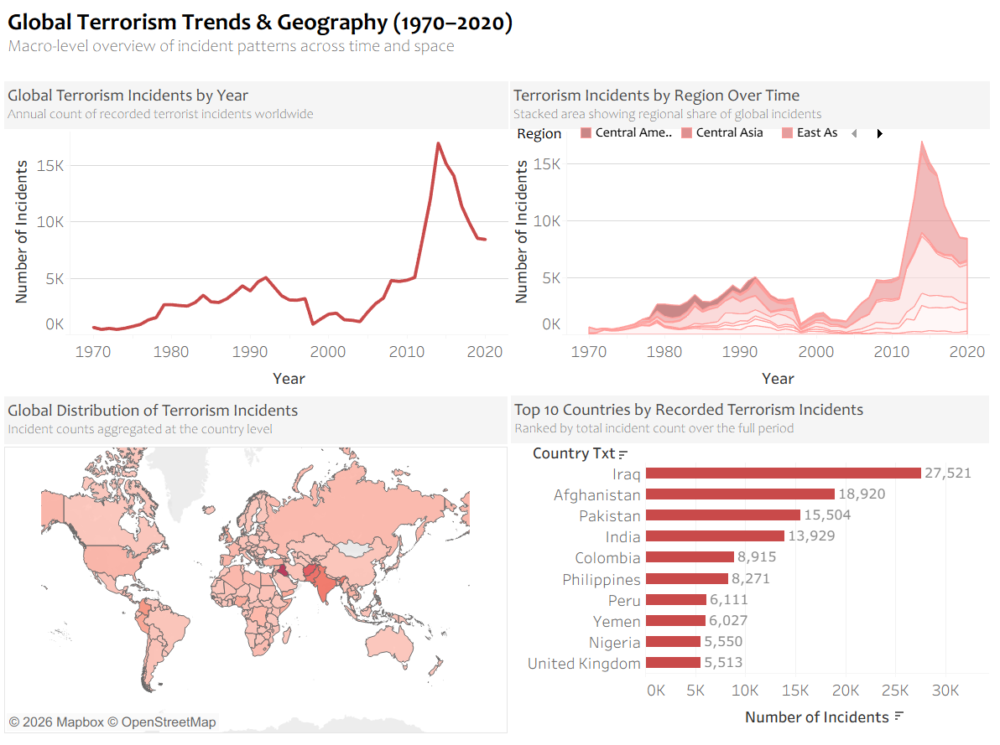
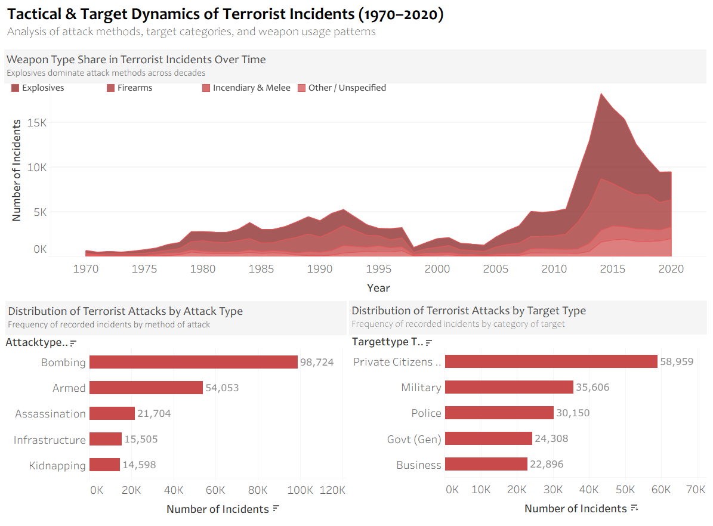

# Global Terrorism Trends & Operational Dynamics (1970–2020) | Python & Tableau

## Overview
This project presents an **exploratory and descriptive analysis** of global terrorism patterns using data from the **Global Terrorism Database (GTD)** covering the period **1970–2020**.

The objective of this project is to understand **how terrorism has evolved over time** in terms of:
- global and regional trends  
- attack methods and targets  
- operational complexity of incidents  
- human impact (deaths and injuries)  
- reporting certainty and data limitations  

The analysis is conducted using **ethical, aggregated, and non-sensational approaches**, and is designed as a **portfolio-focused learning project** for a **student / fresher / aspiring data analyst**.

---

## Dataset Overview
- **Dataset:** Global Terrorism Database (GTD)  
- **Data Provider:** National Consortium for the Study of Terrorism and Responses to Terrorism (START), University of Maryland  
- **Time Period:** 1970–2020  
- **Geographic Coverage:** Global  

> ⚠️ **Important Note:**  
> This project uses data from the **Global Terrorism Database (GTD)**.  
> The original raw dataset is **not stored in this repository** due to size and ethical considerations.
>
> - Official GTD Website: https://www.start.umd.edu/gtd  
> - Data Provider: National Consortium for the Study of Terrorism and Responses to Terrorism (START)
>
> Only **cleaned, transformed, and aggregated datasets** are included here for analytical and educational purposes.

---

## Tools & Technologies
- **Python** – Data normalization, cleaning, aggregation  
- **Pandas & NumPy** – Data manipulation and preparation  
- **Jupyter Notebook** – Reproducible analytical workflow  
- **Tableau Public** – Dashboard development and visual storytelling  
- **GitHub** – Version control and project documentation  

---

## Project Structure
The project follows a structured analytics workflow:

- Raw data understanding and normalization using Python  
- Creation of fact, dimension, and bridge tables  
- Cleaning and validation of modeled datasets  
- Dashboard development in Tableau using aggregated data  
- Clear documentation of insights, limitations, and ethical considerations  

---

## Dashboards Overview

### **D1 – Global Trends & Geography**
Analyzes long-term global terrorism trends and regional distribution of incidents across decades.

### **D2 – Tactical & Target Dynamics**
Explores how attacks are carried out, including weapon types, attack methods, and target categories.

### **D3 – Operational Complexity & Incident Characteristics**
Focuses on incident structure, such as single vs coordinated attacks and extended vs non-extended events.

### **D4 – Severity, Impact & Outcomes**
Examines the human impact of terrorism through deaths, injuries, and severity differences by attack type and region.

### **D5 – Attribution, Certainty & Analytical Limitations**
Highlights reporting certainty, classification confidence, and limitations inherent in terrorism data.

---

## Dashboard Preview

### Global Trends & Geography

### Tactical & Target Dynamics

---

📄**Full Dashboard (All Pages – PDF):**  
🔹[View Complete Dashboard PDF](06_Dashboards/Dashboards.pdf)

This PDF contains **all dashboard pages across Market & Sales, Delivery & Operations, Retail Store, and Customer analysis**.

---
### 🌐 Tableau Public – Interactive Dashboards

The complete interactive dashboards for this project are published on Tableau Public:

 **View on Tableau Public:**  
🔗 [gauravshinde17](https://public.tableau.com/app/profile/gauravshinde17/viz/GlobalTerrorismTrendsDynamics19702020/D5-AttributionCertaintyAnalyticalLimitations)

---

## Key Insights
- Terrorism activity shows **distinct periods of escalation and decline**, rather than a continuous upward trend.
- A small number of regions contribute a **large share of global incidents** over time.
- Explosives remain the most frequently used weapon type across decades.
- Most incidents are **single and non-extended**, even during high-activity periods.
- Human impact varies significantly across regions and attack types.
- Earlier decades show **higher reporting uncertainty**, highlighting data quality limitations.

---

## Ethical Approach & Limitations
This project follows a **responsible and academic analytical approach**:

- Analysis is performed at **aggregated levels only**  
- No incident-level storytelling or case narratives  
- No perpetrator ranking or profiling  
- Neutral language and restrained visual design  
- Clear acknowledgment of data uncertainty and reporting bias  

Findings should be interpreted as **descriptive patterns**, not causal explanations.

---

## Learning Outcomes
Through this project, I practiced and demonstrated:
- Structuring complex datasets into analytical models  
- Applying data cleaning and validation techniques  
- Designing clear, narrative-driven dashboards  
- Communicating insights responsibly using data visualization  
- Maintaining professional project organization and documentation  

---

